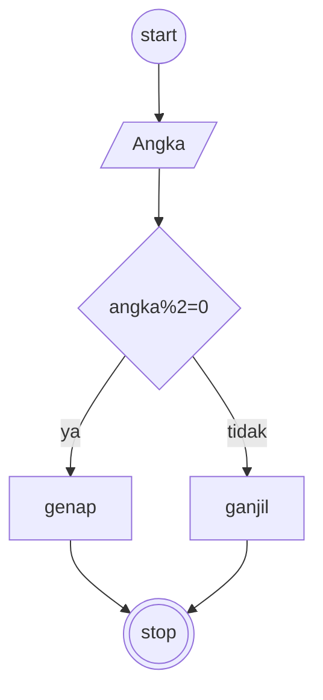

# Menentukan Angka Ganjil dan Genap

```mermaid
flowchart TD;

strt((start))-->a[/Angka/];
a[/Angka/]-->dcs{angka%2=0};
dcs{angka%2=0}--ya-->genap;
dcs{angka%2=0}--tidak-->ganjil;
genap-->stp(((stop)));
ganjil-->stp(((stop)));

```
