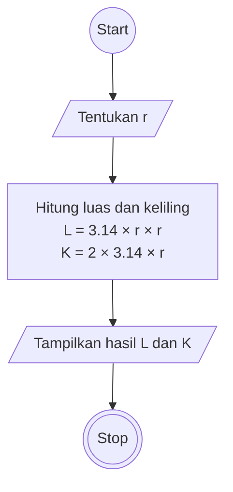

#Menghitung luas dan keliling lingkaran

```mermaid
flowchart TD;

strt((Start)) --> i[/Tentukan r/];
i --> P[Hitung luas dan keliling<br>L = 3.14 × r × r<br>K = 2 × 3.14 × r];
P --> o[/Tampilkan hasil L dan K/];
o --> stp(((Stop)));


```
