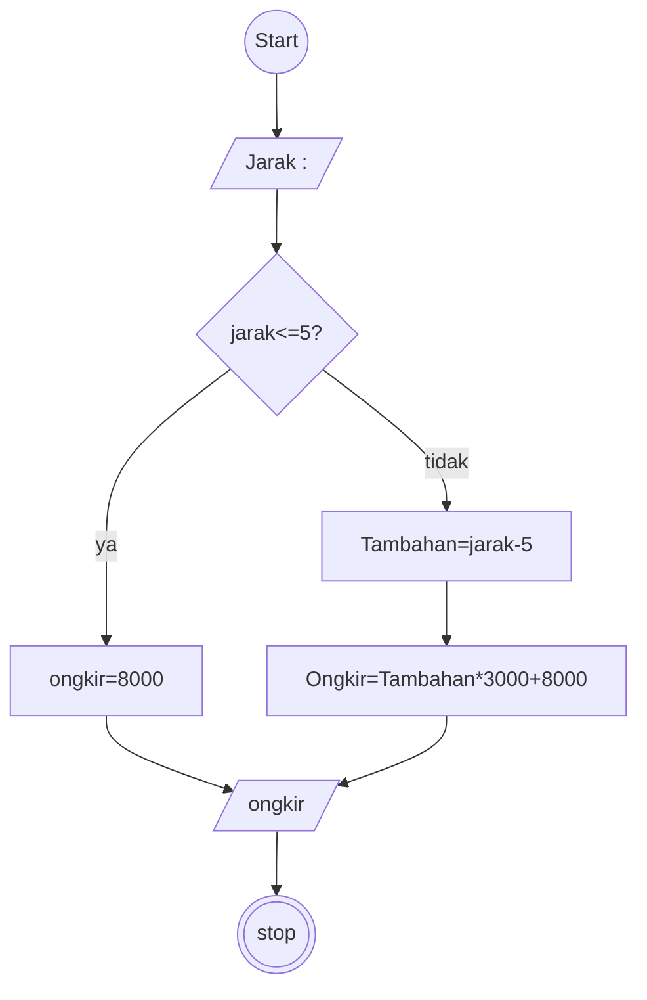

# Progam Cek Ongkir

```mermaid
flowchart TD;

strt((Start))-->km[/Jarak : /]
km-->dcs{jarak<=5?};
dcs--tidak-->Tambahan[Tambahan=jarak-5];
Tambahan-->hsl2[Ongkir=Tambahan*3000+8000];
dcs--ya-->hsl1[ongkir=8000];
hsl1-->total[/ongkir/];
hsl2-->total[/ongkir/];
total[/ongkir/]-->stp(((stop)));

```
