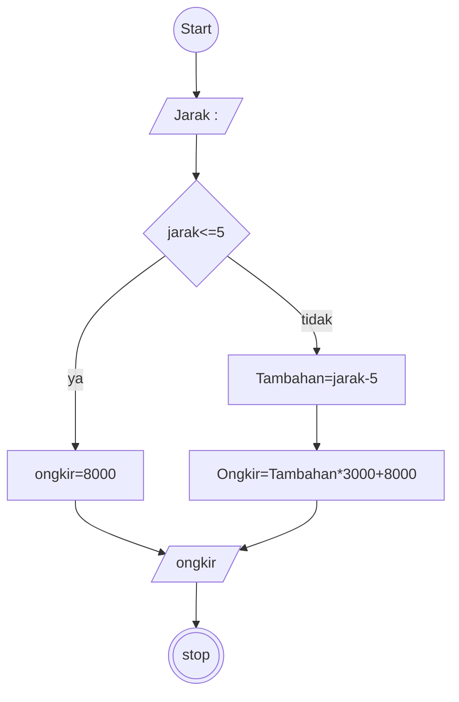

# Progam Cek Ongkir

```mermaid

flowchart TD
km[/Jarak : /]
dcs{jarak<=5}
Tambahan[Tambahan=jarak-5]
b[Ongkir=Tambahan*3000+8000]
a[ongkir=8000]
total[/ongkir/]

strt((Start))-->km
km-->dcs
dcs--tidak-->Tambahan
Tambahan-->b
dcs--ya-->a;
a-->total;
b-->total;
total-->stp(((stop)));

```
