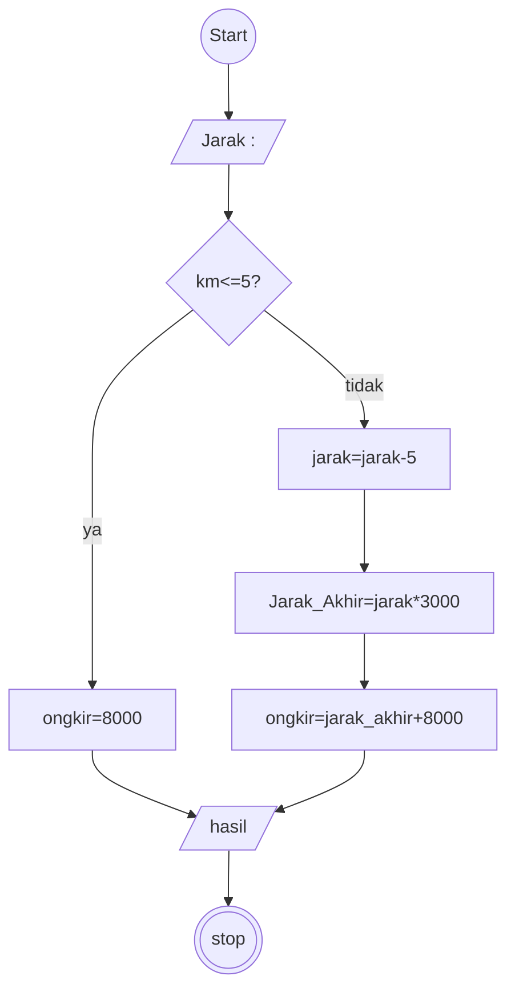

# Progam Cek Ongkir

```mermaid
flowchart TD;

strt((Start))-->km[/Jarak : /]
km-->dcs{km<=5?};
dcs--tidak-->hsl2[jarak=jarak-5];
hsl2-->jrk_akhir[Jarak_Akhir=jarak*3000];
jrk_akhir-->ongkir[ongkir=jarak_akhir+8000]
dcs--ya-->hsl1[ongkir=8000];
hsl1-->total[/hasil/];
ongkir-->total[/hasil/];
total[/hasil/]-->stp(((stop)));

```
