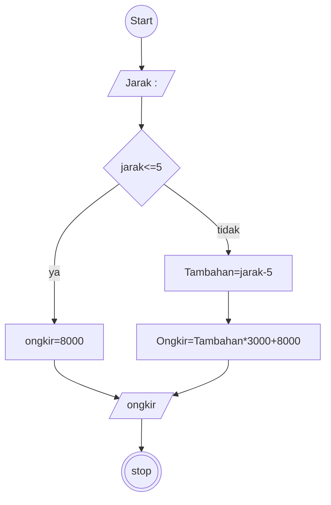

# Progam Cek Ongkir

```mermaid
flowchart TD;

strt((Start))-->km[/Jarak : /]
km-->dcs{jarak<=5};
dcs--tidak-->Tambahan[Tambahan=jarak-5];
Tambahan-->b[Ongkir=Tambahan*3000+8000];
dcs--ya-->a[ongkir=8000];
a-->total[/ongkir/];
b-->total[/ongkir/];
total[/ongkir/]-->stp(((stop)));

```
