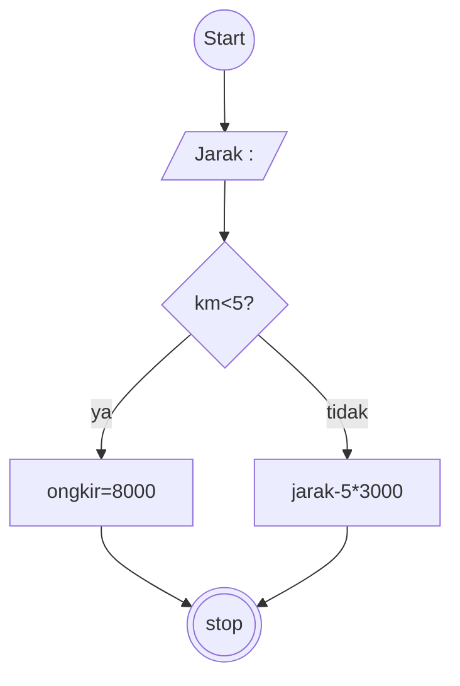

# Progam Cek Ongkir

```mermaid
flowchart TD;

strt((Start))-->km[/Jarak : /]
km-->dcs{km<5?};
dcs--ya-->okr1[ongkir=8000];
dcs--tidak-->hsl[jarak-5*3000];
okr1-->stp(((stop)));
hsl-->stp(((stop)));


```
