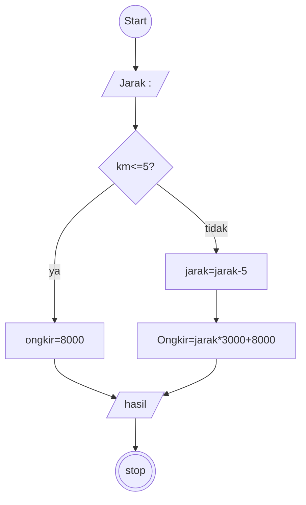

# Progam Cek Ongkir

```mermaid
flowchart TD;

strt((Start))-->km[/Jarak : /]
km-->dcs{km<=5?};
dcs--tidak-->jarak[jarak=jarak-5];
jarak-->hsl2[Ongkir=jarak*3000+8000];
dcs--ya-->hsl1[ongkir=8000];
hsl1-->total[/hasil/];
hsl2-->total[/hasil/];
total[/hasil/]-->stp(((stop)));

```
