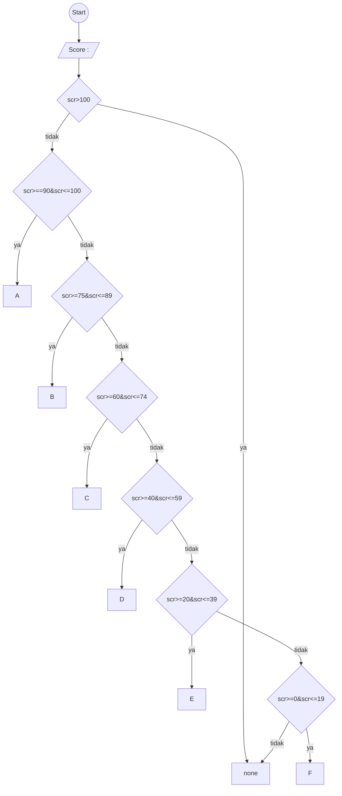

# Progam Cek Nilai

```mermaid
flowchart TD;

strt((Start))-->scr[/Score : /]
scr-->dcs0{scr>100}
dcs0--ya-->none
dcs0--tidak-->dcs1{scr>==90&scr<=100}
dcs1--ya-->A
dcs1--tidak-->dcs2{scr>=75&scr<=89}
dcs2--ya-->B
dcs2--tidak-->dcs3{scr>=60&scr<=74}
dcs3--ya-->C
dcs3--tidak-->dcs4{scr>=40&scr<=59}
dcs4--ya-->D
dcs4--tidak-->dcs5{scr>=20&scr<=39}
dcs5--ya-->E
dcs5--tidak-->dcs6{scr>=0&scr<=19}
dcs6--ya-->F
dcs6--tidak-->none


```
