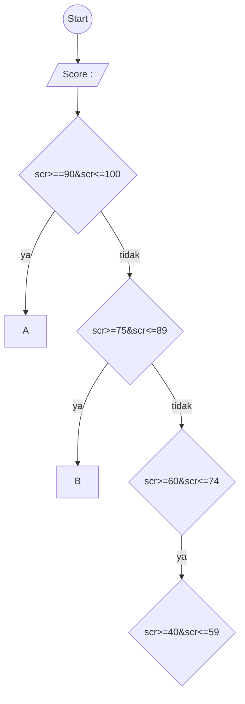

# Progam Cek Nilai

```mermaid
flowchart TD;

strt((Start))-->scr[/Score : /]
scr-->dcs1{scr>==90&scr<=100}
dcs1--ya-->A
dcs1--tidak-->dcs2{scr>=75&scr<=89}
dcs2--ya-->B
dcs2--tidak-->dcs3{scr>=60&scr<=74}
dcs3--ya-->dcs4{scr>=40&scr<=59}
```
